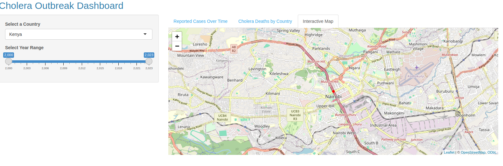
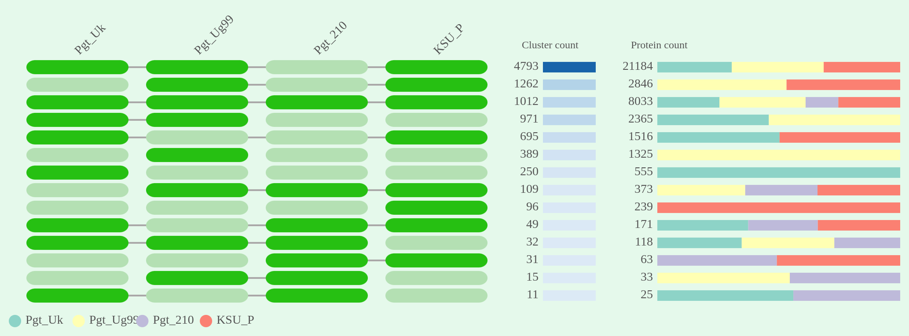
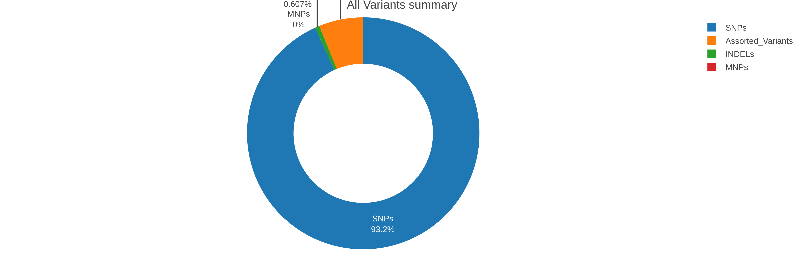

# About me

&nbsp;&nbsp;&nbsp;&nbsp;&nbsp;&nbsp;&nbsp;&nbsp;&nbsp;&nbsp;&nbsp;&nbsp;&nbsp;&nbsp;&nbsp;&nbsp;&nbsp;&nbsp; &nbsp;&nbsp;&nbsp; &nbsp;&nbsp;&nbsp;&nbsp;

**Biotechnologitst | Bioinformatician | Molecular Biologist | Research and Design(R&D)**
I am a passionate biotechnologist, molecular biologist, and bioinformatician with strong enthusiasm for bridging lab science and computational analysis. My work spans applying molecular tools, exploring genetic mechanisms, and using data-driven approaches to solve challenges in health, agriculture, and biotechnology.

## Research Interests

- Multi-omics data intergration and analysis
- Genomics and Epdidemiology
- Molecular Docking and drug discovery
- Metagenomics
- Agricultural Biotechnology

### Education

- BSc in Biotechnology and Biosafety - University of Eldoret(2021 -2025)
- Data Analytics - Holberton School(ALX Africa)(2025 - Present)

#### Featured Projects

**Cholera Epidemiology Project**

Designed a cholera epidemiology surveillance dashboard using R to track and visualize cholera outbreaks, enhancing public health response strategies.
**Skills & Tools: R shiny, Epidemiology, Data wrangling and visualization**

[Link to dashboard](https://pollanda.shinyapps.io/cholera_outbreak/)

[Read more](https://github.com/Itsbosire/HackBio_Epidemiology_project)

**Phylogenetic Analysis and Comparative Genomics**

Conducted comprehensive phylogenetic analysis and comparative genomics of *Puccinia graminis f.s.p* isolates, providing insights into their evolutionary relationships and pathogenicity.
**Tools: Bash, FastQC, MultiQC, Fastp, Busco, Quast, Augustus, EggNog Mapper, Orthofinder, MAFFT, iTol, Fasttree, MuMmer, Snippy**

[Read more](https://github.com/Itsbosire/Phylo_Genomics)

**MRSA Genome Assembly**

Stapled a complete genome assembly of Methicillin-resistant *Staphylococcus aureus* (MRSA) using Illumina sequencing data, enhancing understanding of its genetic makeup and resistance mechanisms.
**Tools: FastQC, Fastp, Spades, Quast**

[Read more](https://github.com/Itsbosire/MRSA_Genome_Assembly)

**MTB Variant Calling Pipeline**

Developed a robust NGS variant calling pipeline for *Mycobacterium tuberculosis* (MTB) using bash scripting, automating the analysis of sequencing data to identify genetic variants associated with drug resistance.
**Tools: FastQC, MultiQC, Fastp, BWA, Samtools, freebayes**

[Read more](https://github.com/Itsbosire/MRSA_Genome_Assembly)

To view more of my projects, please visit my [GitHub profile](https://github.com/Itsbosire).

#### Skills

**Bioinformatics**: Genome Assembly, Variant Calling, Phylogenetics, Comparative Genomics, Molecular Docking, NGS Data Analysis, Sequence Alignment, Data Visualization

**Programming Languages**: Python, R, Bash

**Laboratory Techniques**: PCR, Gel Electrophoresis, DNA/RNA Extraction, Spectrophotometry, Microscopy

**Tools & Software**: Bioconductor, Galaxy, MEGA, AutoDock Vina , PyMOL, FastQC, Trimmomatic, BWA, SAMtools, GATK, IGV, RStudio, Git/GitHub,velvet, SPAdes, Prokka, BLAST, ClustalW, MAFFT,Orthofinder, IQ-TREE, FigTree, VMD, Discovery Studio

**Soft Skills**: Problem-Solving, Critical Thinking, Communication, Teamwork, Adaptability, Time Management

#### Contact Me

I am always open to connecting with fellow researchers, professionals, and enthusiasts in the fields of biotechnology, molecular biology, and bioinformatics.
Reach out to me via email, phone, or social media for collaborations, discussions, or opportunities.

#### Location

Eldoret , Kenya.
